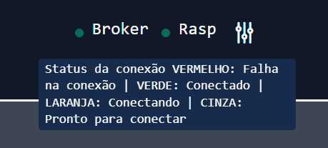
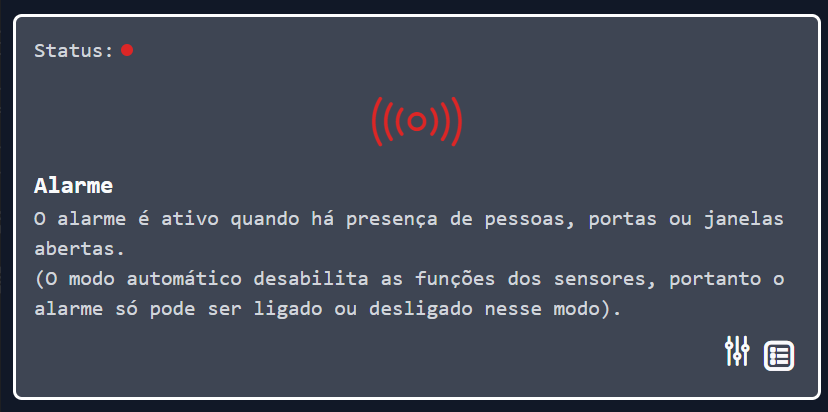
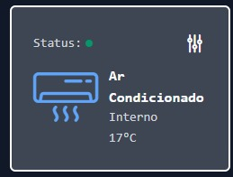
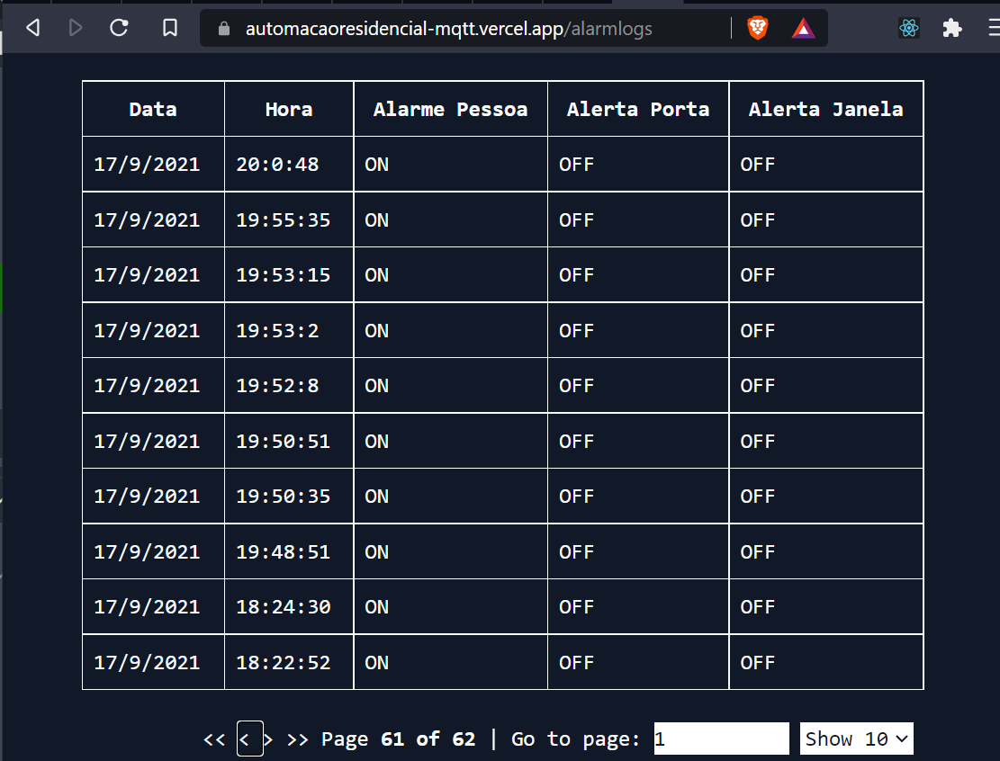

# Automação residencial

### O problema

Neste problema, foi proposto a implementação do protótipo de um equipamento que colete as informações do circuito controlador de um sistema inteligente, disponibilizando em uma página Web, além de uma Assistente de voz, na qual foi escolhida a Google Assistente, utilizando o Dialogflow. O circuito controlador é o mesmo do problema anterior, contendo: iluminação da garagem e do jardim, iluminação de ambientes internos, central de alarme e climatização na sala de TV. Para a solução deste protótipo, foi determinado o protocolo de comunicação MQTT para as trocas de mensagens entre a página web e o sistema inteligente (circuito controlador), além da troca de mensagem da Assistente com o circuito controlador.

O frontend da aplicação está hospedado na plataforma Vercel nesse <a href="https://automacaoresidencial-mqtt.vercel.app/"> Link </a>

## Manuseio da interface

### Conexão com o broker

Na parte superior da interface há um indicador de status da conexão do frontend com o broker e com a <em>Raspberry</em>. Também há um botão para a configuração do tempo de ping para a rasp.

### Modo automático

Logo em seguida há um card indicando o modo automático. Quando ativo, a aplicação passa a ser controlada pela as entradas da rasp, e quando inativo o usuário pode controlar os estados com botões na aplicação

### Alarme

Indica o status do alarme e emite um sinal vermelho quando há uma potencial invasão acontecendo. Quando normalizado o ícone e o status ficam verdes

## Ar condicionado

Indicação do status do ar condicionado e a sua temperatura

## Configuração dos dispositivos

Faixa de operação da temperatura quando está em modo automático ao clicar no ícone de configuração

A iluminação interna e o alarme são controlados por sensores

O jardim e a garagem podem ter seus horários modificados

## Logs do Alarme

Na rota `/alarmlogs` que pode ser acessada no card do alarm é possível ver o os logs do alarme

---

# Getting Started with Create React App

This project was bootstrapped with [Create React App](https://github.com/facebook/create-react-app).

## Available Scripts

In the project directory, you can run:

### `yarn start`

Runs the app in the development mode.\
Open [http://localhost:3000](http://localhost:3000) to view it in the browser.

The page will reload if you make edits.\
You will also see any lint errors in the console.

### `yarn test`

Launches the test runner in the interactive watch mode.\
See the section about [running tests](https://facebook.github.io/create-react-app/docs/running-tests) for more information.

### `yarn build`

Builds the app for production to the `build` folder.\
It correctly bundles React in production mode and optimizes the build for the best performance.

The build is minified and the filenames include the hashes.\
Your app is ready to be deployed!

See the section about [deployment](https://facebook.github.io/create-react-app/docs/deployment) for more information.

### `yarn eject`

**Note: this is a one-way operation. Once you `eject`, you can’t go back!**

If you aren’t satisfied with the build tool and configuration choices, you can `eject` at any time. This command will remove the single build dependency from your project.

Instead, it will copy all the configuration files and the transitive dependencies (webpack, Babel, ESLint, etc) right into your project so you have full control over them. All of the commands except `eject` will still work, but they will point to the copied scripts so you can tweak them. At this point you’re on your own.

You don’t have to ever use `eject`. The curated feature set is suitable for small and middle deployments, and you shouldn’t feel obligated to use this feature. However we understand that this tool wouldn’t be useful if you couldn’t customize it when you are ready for it.

## Learn More

You can learn more in the [Create React App documentation](https://facebook.github.io/create-react-app/docs/getting-started).

To learn React, check out the [React documentation](https://reactjs.org/).

### Code Splitting

This section has moved here: [https://facebook.github.io/create-react-app/docs/code-splitting](https://facebook.github.io/create-react-app/docs/code-splitting)

### Analyzing the Bundle Size

This section has moved here: [https://facebook.github.io/create-react-app/docs/analyzing-the-bundle-size](https://facebook.github.io/create-react-app/docs/analyzing-the-bundle-size)

### Making a Progressive Web App

This section has moved here: [https://facebook.github.io/create-react-app/docs/making-a-progressive-web-app](https://facebook.github.io/create-react-app/docs/making-a-progressive-web-app)

### Advanced Configuration

This section has moved here: [https://facebook.github.io/create-react-app/docs/advanced-configuration](https://facebook.github.io/create-react-app/docs/advanced-configuration)

### Deployment

This section has moved here: [https://facebook.github.io/create-react-app/docs/deployment](https://facebook.github.io/create-react-app/docs/deployment)

### `yarn build` fails to minify

This section has moved here: [https://facebook.github.io/create-react-app/docs/troubleshooting#npm-run-build-fails-to-minify](https://facebook.github.io/create-react-app/docs/troubleshooting#npm-run-build-fails-to-minify)
